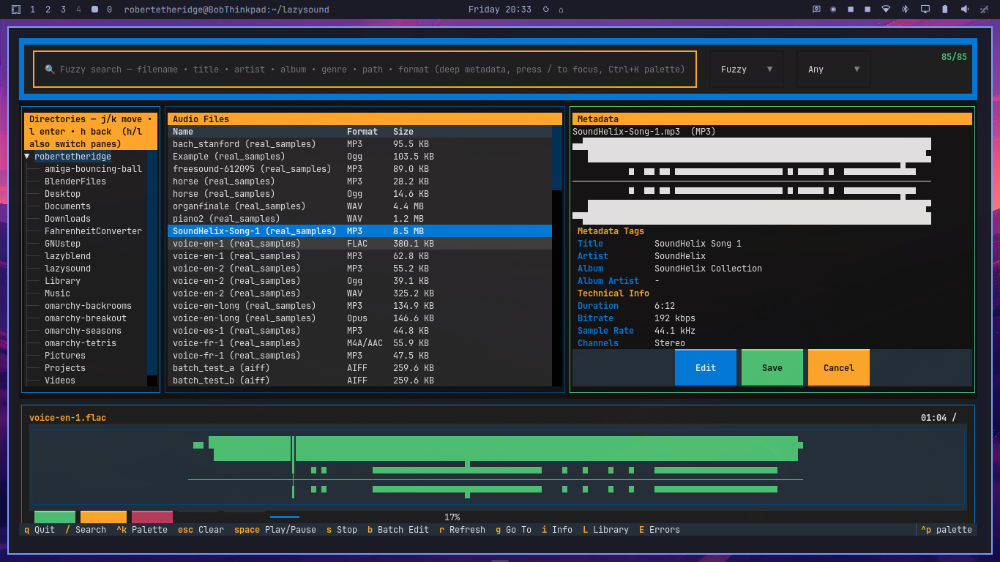

# lazySound

A terminal user interface for managing, searching, previewing, and **playing** audio files — built for professional DAW users who need a quick helper for managing file libraries.



## Features

- **Browse** directory trees with vim `hjkl` drill-down (`l` enter, `h` back to parent, `j/k` move, `G`/`Home` top/bottom, `Ctrl+d/u` page)
- **System-wide library** — scans `~`, `/usr/share/sounds`, `/opt`, `/media` for folders with sound/music/DAW projects, caches in `~/.cache/lazysound/library.json` (press `L` to browse, `r` rescan, `Enter` open)
- **Fuzzy search front-and-center** — `Wanted Ratio` + `partial` + `token_sort` via `rapidfuzz` across deep metadata (filename, title, artist, **albumartist**, album, genre, path, format, technical), 60 threshold; `Ctrl+K` palette, `/` focus, `Esc` clear, live `3/85 • 85 indexed` count
- **View & edit** metadata tags across all major formats (FLAC, MP3, M4A, WAV, AIFF, Ogg, Opus…) — editable `Tree` via `i` (see Info panel)
- **Info panel (`i`)** — dedicated editable tree (`Common Tags` / `All Tags` / `Technical` / `Raw`), `j/k` navigate, `h/l` collapse/expand, `e`/`Enter` edit, `a` add, `d` delete, `Ctrl+S` save, `Esc` close; writes via `mutagen` and keeps search index in sync (e.g. `Album Artist: Bob` is found by `Artist: Bob`)
- **Batch editing** (`b`) — apply tag changes to multiple files at once
- **Playback with waveform** — `Space` play/pause, `s` stop, `←/→` seek ±5s, click waveform to jump; ASCII waveform with playhead (`┃`) and progress bar, resampled to device rate (44100/48000) with `soxr`/`librosa`, mono→stereo, `blocksize=2048` `latency=low` for smooth output
- **Metadata side panel** — auto-populates on startup and after search (first valid file), shows 14 standard fields + 7 technical + waveform; `Edit`/`Save`/`Cancel` always visible (docked, responsive down to 80×24) with HTML placeholder filtering
- **Error handling** — `HTML 404` placeholders (e.g. `meow.mp3` 315 bytes) filtered from scanner/library, shown as `⚠ HTML 404 — not audio` waveform; persistent log at `~/.cache/lazysound/errors.log`, view with `E` / `Ctrl+E` (`ErrorLogScreen` with `j/k`, `c` clear, `Enter` open folder)
- **DAW-aware** — detects `rpp`, `ptx`, `logicx`, `ardour`, `dawproject`

## Screenshot

The TUI in action — three panes + fuzzy bar + playback:


*Left: Directories (vim drill), Center: Audio Files (fuzzy filtered), Right: Metadata Tags + Technical Info, Bottom: waveform + transport*

## Supported Formats

| Format | Read/Write | Notes |
|--------|-----------|-------|
| FLAC | R/W | Vorbis Comments |
| MP3 | R/W | ID3v1/v2 (via `ID3` `TIT2`/`TPE1`/`TPE2` etc.) |
| M4A/AAC | R/W | MP4 atoms (`©nam`, `©ART`) |
| WAV | R/W | RIFF INFO / ID3 (`TIT2`) |
| AIFF | R/W | AIFF chunks / ID3 |
| Ogg Vorbis | R/W | Vorbis Comments |
| Opus | R/W | Vorbis Comments |
| WavPack | R/W | APEv2 |
| Monkey's Audio | R/W | APEv2 |
| True Audio | R/W | APEv2 |
| Musepack | R/W | APEv2 |

## DAW Project Support

Pluggable architecture for reading DAW project files:

- **Reaper** (`.RPP`) - tracks, markers, regions
- **Pro Tools** (`.ptx`) - planned
- **Logic Pro** (`.logicx`) - planned
- **Ardour** (`.ardour`) - planned
- **DAWproject** (`.dawproject`) - cross-DAW exchange format

## Installation

```bash
# From source — wrapper makes `lazysound` available globally
git clone https://github.com/Boboloboramba/lazysound.git
cd lazysound
python -m venv .venv
.venv/bin/pip install -e .

# Put `lazysound` on your PATH (so you don't need .venv/bin/lazysound)
ln -sf $(pwd)/.venv/bin/lazysound ~/.local/bin/lazysound  # ~/.local/bin is on PATH on Omarchy
# alternative via pipx (if you have it):
# pipx install -e .

# With DAW support
.venv/bin/pip install -e ".[daw]"

# Development
.venv/bin/pip install -e ".[dev]"
```

Dependencies: `textual>=0.80`, `mutagen>=1.47`, `librosa>=0.10`, `numpy>=1.24`, `soundfile>=0.12`, `sounddevice>=0.5`, `audioread>=3.0`, `rapidfuzz>=3.0` (+ `soxr` via librosa for resampling).

## Usage

```bash
# Just type `lazysound` — scans your system for all audio folders
# (home + /usr/share/sounds etc, cached in ~/.cache/lazysound/library.json)
# Shows 85+ files from your real library; press L to browse all folders
lazysound

# Open specific directory
lazysound ~/Music/audio
lazysound ./test_audio      # 27 generated tones (beeps)
lazysound ./real_samples    # 18 real music + voice samples (SoundHelix 6:12, Bach, piano, organ, gTTS speech)

# Open with config file
lazysound --config ~/.config/lazysound/config.json
```

*Real samples:* `real_samples/` contains 18 files fetched/generated for testing beyond beeps: `SoundHelix-Song-1.mp3` (8.6M), `bach_stanford.mp3`, `piano2.wav`, `organfinale.wav`, `Example.ogg`, plus `gTTS` voice (`voice-en-1.mp3`/`flac`/`wav`/`ogg`/`opus`, `voice-fr/es`, long) — all tagged and verified for fuzzy search and smooth playback.

### Keybindings

| Key | Action |
|-----|--------|
| `q` | Quit |
| `/` | Focus fuzzy search (deep metadata, WRatio) |
| `Ctrl+K` | Fuzzy palette (system-wide) |
| `Esc` | Clear search / close palette / close modal |
| `i` / `I` | Info — editable tree view for selected file (j/k navigate, h/l collapse/expand, e edit, a add, d delete, Ctrl+S save, Esc close) |
| `L` / `Ctrl+L` | Library — system-wide folders with audio/DAW files (r rescan, Enter open) |
| `E` / `Ctrl+E` | Error log — persistent decode failures (HTML 404 etc, j/k, c clear, Enter open folder) |
| `Space` | Play / Pause (selected file, with waveform + progress) |
| `s` | Stop |
| `←` / `→` | Seek -5s / +5s (click waveform to jump) |
| `h` / `l` | Focus left / right pane — **in Directories** `h` parent (`cd ..`), `l` enter child |
| `j` / `k` | Cursor down / up (live preview, updates side panel) |
| `G` / `Home` / `End` | Bottom / Top |
| `Ctrl+d` / `Ctrl+u` | Page down / up |
| `b` | Batch edit selected files |
| `r` | Refresh |
| `g` | Go to directory |
| `Enter` | Select file / expand directory |

### Navigation

- **Top**: Fuzzy bar (`🔍 Fuzzy search — filename • title • artist • album • genre • path • format`) with live `3/85 • 85 indexed` count
- **Left pane** (`28` wide): Directory tree — `j/k` move, `l` enter, `h` back
- **Center pane**: Audio file list (Name, Format, Size) — `j/k` live preview, auto-selects first file on startup/search
- **Right pane** (`24` min): Metadata viewer/editor with waveform preview — auto-populates, 15 tag rows + 8 tech rows, docked `Edit`/`Save`/`Cancel` (responsive to 80×24)
- **Bottom**: Playback — waveform with `┃` playhead, `00:00 / 06:12`, `▶ Play`/`⏸`/`■ Stop`/`⏮`/`⏭`, `ProgressBar`

## Configuration

Config file at `~/.config/lazysound/config.json`:

```json
{
  "default_directory": "~/Music/audio",
  "show_hidden_files": false,
  "waveform_width": 80,
  "waveform_height": 8,
  "case_sensitive_search": false,
  "confirm_batch_edit": true,
  "enabled_formats": ["flac", "wav", "mp3", "ogg", "opus", "m4a", "aiff"]
}
```

Library cache at `~/.cache/lazysound/library.json`, error log at `~/.cache/lazysound/errors.log`.

## Project Structure

```
lazysound/
├── screenshot.png            # TUI screenshot (this README)
├── lazysound/
│   ├── app.py                # Entry point & Textual App (system scan default)
│   ├── config.py             # User configuration
│   ├── core/
│   │   ├── scanner.py        # Directory scanning + HTML placeholder filter
│   │   ├── metadata.py       # Mutagen wrapper (MP3 ID3 via tags, AIFF/WAV TXXX)
│   │   ├── search.py         # Fuzzy (rapidfuzz WRatio) + deep haystack, cache invalidation
│   │   ├── batch.py          # Batch edit operations
│   │   ├── player.py         # sounddevice + soxr resample to device rate, mono→stereo, blocksize 2048
│   │   ├── library.py        # System-wide folder tracking (AudioLibrary)
│   │   └── errors.py         # Persistent error log (E)
│   ├── screens/
│   │   ├── main.py           # Main 3-pane + fuzzy bar + vim bindings + library/info/error actions
│   │   ├── info.py           # Editable metadata tree (i)
│   │   ├── library.py        # Library modal (L)
│   │   └── errors.py         # Error log modal (E)
│   ├── widgets/
│   │   ├── file_browser.py   # Directory tree (vim drill, root expand fix)
│   │   ├── file_list.py      # DataTable with auto-select first file
│   │   ├── metadata_panel.py # Side panel (async mount, docked buttons)
│   │   ├── search.py         # Prominent fuzzy bar + palette
│   │   ├── playback.py       # Bottom transport + waveform + error display
│   │   └── waveform.py       # ASCII waveform + playhead + HTML error box + LRU cache
│   └── daw/
│       ├── base.py
│       └── reaper.py
├── real_samples/             # 18 real music + voice samples (not beeps)
├── test_audio/               # 27 generated tones
└── pyproject.toml
```

## Tech Stack

- **Python 3.11+**
- **[Textual](https://github.com/Textualize/textual)** 8.2+ — TUI framework (reactive, `DataTable`, `Tree`, `ProgressBar`)
- **[Mutagen](https://github.com/quodlibet/mutagen)** 1.47+ — Audio metadata I/O (ID3 `TPE2` for albumartist, Vorbis, MP4)
- **[Librosa](https://github.com/librosa/librosa)** 1.0+ + **[soxr](https://github.com/dofu77/soxr)** 1.1 — Audio analysis & resampling to device rate
- **[SoundFile](https://github.com/bastibe/python-soundfile)** 0.12+ — `libsndfile` I/O
- **[SoundDevice](https://github.com/spatialaudio/python-sounddevice)** 0.5+ — PortAudio playback (`float32`, `blocksize 2048`, `latency low`)
- **[audioread](https://github.com/beetbox/audioread)** 3.0+ — FFmpeg fallback for mp3/m4a/opus
- **[RapidFuzz](https://github.com/maxbachmann/RapidFuzz)** 3.0+ — Fuzzy `WRatio`/`partial` scoring
- **[Rich](https://github.com/Textualize/rich)** — Terminal formatting
- **Numpy**, **scipy**, **numba** — DSP

## Changelog — What's New Since Initial

- **Playback panel** (`d122f1e`) — bottom docked transport with waveform playhead, `Space`/`s`/`←→` and click-to-seek, `soxr` resampling
- **Fuzzy deep search front-and-center** (`0bcd842`) — `Wanted Ratio` across all tags+technical, live count, `Ctrl+K` palette
- **Vim `hjkl`** (`018b581`, `0e63d7e`) — `h` parent/`l` enter in Directories, `j/k` live preview, pane switching, `G`/`Home`/`Ctrl+d/u`, root `expand()` fix
- **System-wide library** (`1010111`) — `AudioLibrary` scans `~` etc, `L` to browse, `r` rescan
- **Editable tree** (`1010111`) — `i` opens `MetadataInfoScreen` Tree, `e`/`a`/`d`/`Ctrl+S`, keeps search index in sync after edit (fixed `Artist` search for `Album Artist: Bob`)
- **Real samples** (`9dd5137`) — 18 music/voice via `gTTS`+`ffmpeg` + `MP3 ID3` fix (`tags.add` via `ID3`, `TPE2`)
- **Global launch** (`474b65f`) — `ln -sf .venv/bin/lazysound ~/.local/bin/lazysound`, default scans system
- **Error handling** (`ad71f46`) — HTML 404 detection, `⚠` waveform, persistent log `E`
- **Choppy fix** (`8fae3e2`) — resample to device rate, mono→stereo, `blocksize 2048`
- **Directories drill fix** (`0e63d7e`) — `h` back, `l` enter
- **Metadata panel** (`47383b1`, `e558ef9`, `0751929`) — async `remove_children`/`mount` order fix, auto-select first file, docked `Edit`/`Save`/`Cancel` responsive, HTML placeholder filter (86→85 files, `meow.mp3` gone)

## License

MIT
